# Testing Pics

- It has come fruition that I cant figure out how to easily look at the game while testing
boards for the tests. This file shows the layout of the board for the tests
- The file **gamestrings.go** contains all of the games listed in this file
- to use the strings for testing include the following at the top of your test

```go
data, err := NewMoveRequest(gameString#)

if err != nil {
  t.Logf("error: %v", err)
}
```

## gameString1


## gameString2


## gameString3


## gameString4

The snake in the lower left should always prefer to go up instead of down or to the right side.

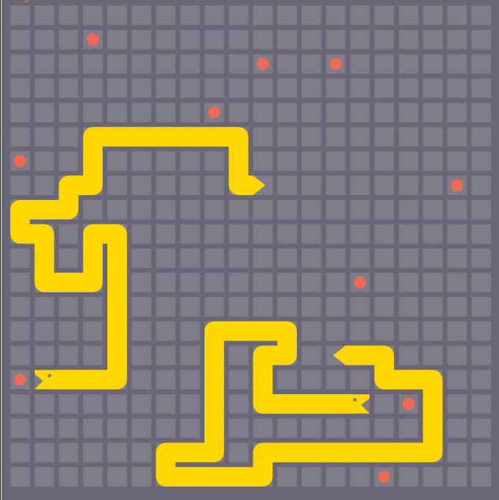

## gameString5

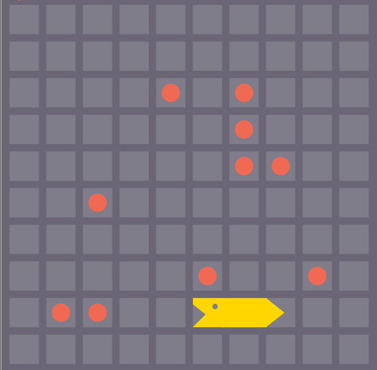

## gameString6

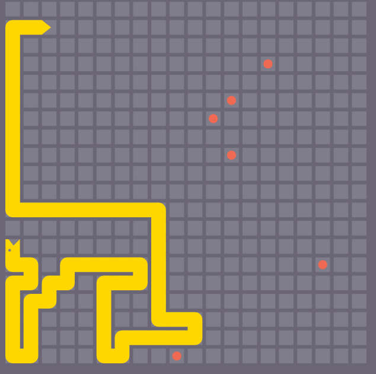

## gameString7

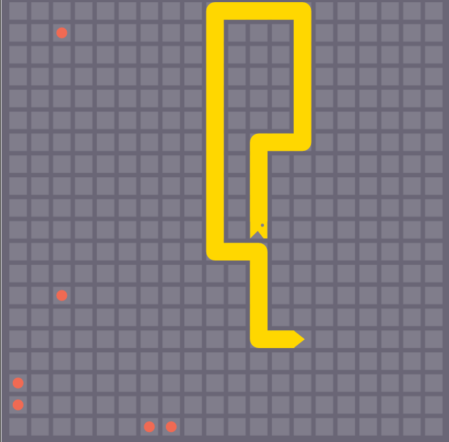

## gameString8


## gameString9

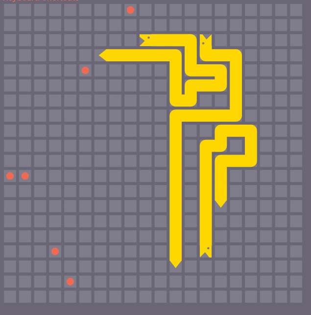

You are the snake with head at [13, 2]

## gameString10

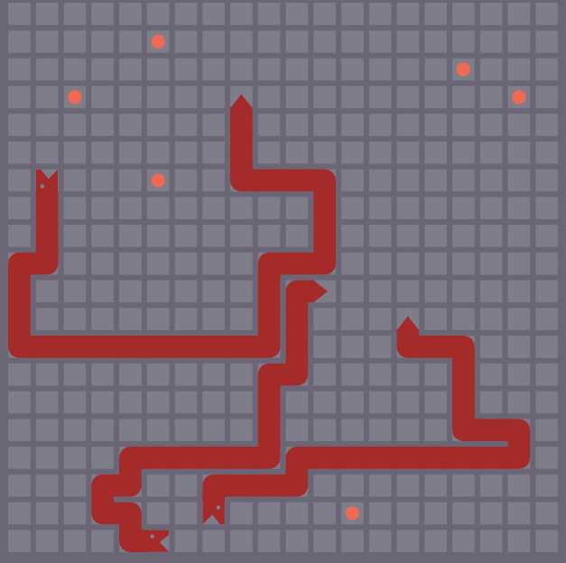

You are the snake with head at [7, 18]

## gameString11

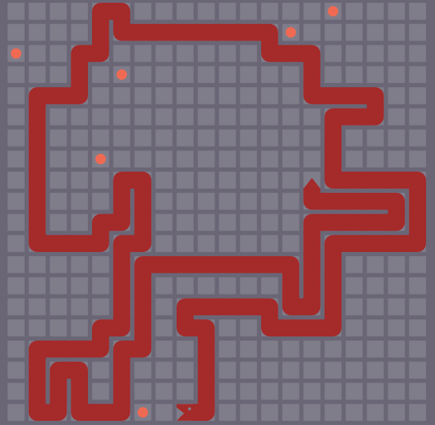

## gameString12

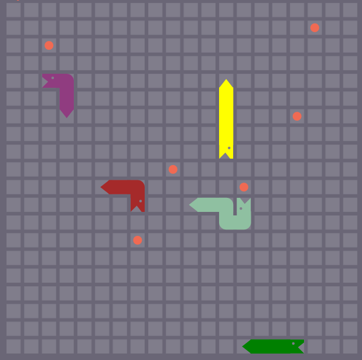

You are the red snake

## gameString13

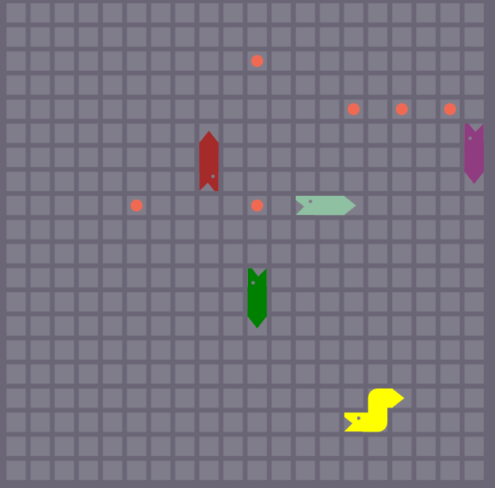

You are the red snake

## gameString14


## gameString15

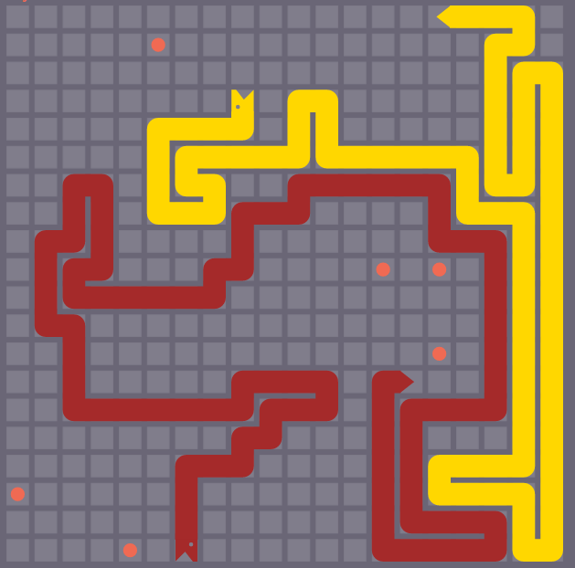

## gameString16


## gameString17

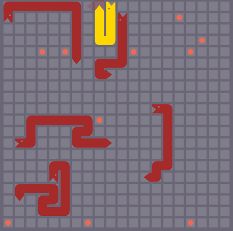

## gameString18

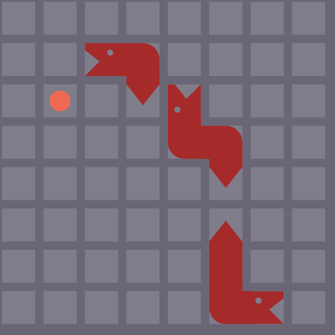
