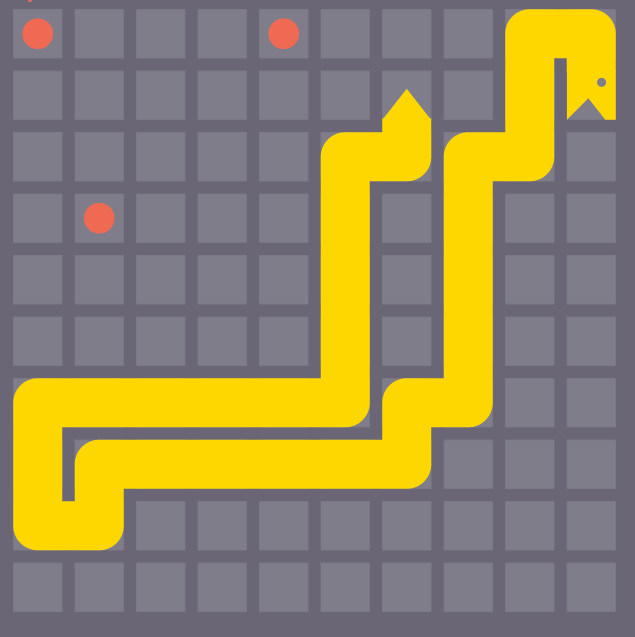
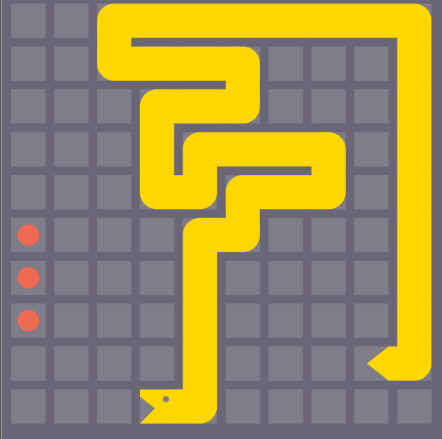
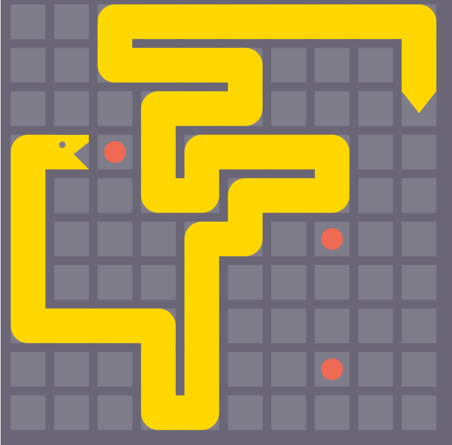

# Testing Pics

- It has come fruition that I cant figure out how to easily look at the game
boards for the tests. This file shows the layout of the board for the tests

Not all tests are here

- used in
  - TestEfficientSpace
  - TestSetMinSnakePointInArea

- used in
  - TestExtraEfficientUseOfSpace

used in TestMetaDataOnlyOneSnake

data, err := NewMoveRequest(`{"you":"82557bbc-5ff2-4e51-8133-f6875d4f8d71","width":10,"turn":233,"snakes":[{"taunt":"battlesnake-go!","name":"7eef72e9-72fc-4c27-a387-898384639f46 (10x10)","id":"82557bbc-5ff2-4e51-8133-f6875d4f8d71","health_points":100,"coords":[[1,3],[0,3],[0,4],[0,5],[0,6],[0,7],[1,7],[2,7],[3,7],[3,8],[3,9],[4,9],[4,8],[4,7],[4,6],[4,5],[5,5],[5,4],[6,4],[7,4],[7,3],[6,3],[5,3],[4,3],[4,4],[3,4],[3,3],[3,2],[4,2],[5,2],[5,1],[4,1],[3,1],[2,1],[2,0],[3,0],[4,0],[5,0],[6,0],[7,0],[8,0],[9,0],[9,1],[9,2],[9,2]]}],"height":10,"game_id":"7eef72e9-72fc-4c27-a387-898384639f46","food":[[6,2],[7,5],[2,3]],"dead_snakes":[]}`)
if err != nil {
  t.Logf("error: %v", err)
}
